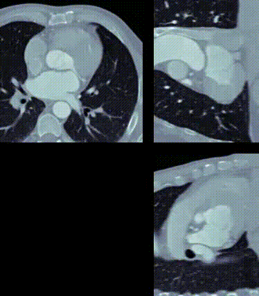
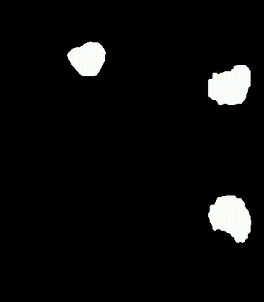
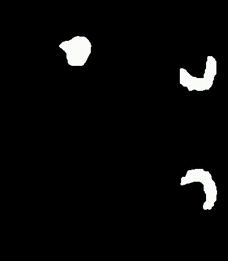

# Controlled Augmentations of Left Ventricle Deformation for Optical Flow Model Training

**Cardio Volume Skewer** is a Python package for generating synthetic cardiac CT deformation sequences from a single 3D image. It creates deformed 3D frames together with dense 3D optical-flow ground-truth annotations by modeling radial, longitudinal, and circumferential motion around the main axis of the left ventricle (LV).

📖 **Published chapter:** [Controlled Augmentations of Left Ventricle Deformation for Optical Flow Model Training](https://www.intechopen.com/online-first/1238800)  
*Artificial Intelligence in Medicine and Surgery – An Exploration of Current Trends, Potential Opportunities, and Evolving Threats, Volume 4*, IntechOpen, 2026.  
[DOI](https://doi.org/10.5772/intechopen.1014562) · [Preprint](https://arxiv.org/abs/2406.01040)

## Installation

Install the package directly from GitHub:

```bash
pip install git+https://github.com/shaharzuler/cardio_volume_skewer
```

## Sample Output



## Overview

The package supports configurable parameters including:

- Magnitude of each deformation component.
- Number of frames in the generated sequence.
- Distribution of the circumferential component along the main axis.
- Optional restriction of the deformation to voxels within the LV segmentation mask.
- Optional image downscaling for improved computational efficiency.

## Example Usage

```python
from cardio_volume_skewer import create_skewed_sequences

output_dir = "path/to/outputs/folder"
r1, r2, h, theta1, theta2 = 0.7, 0.7, 0.85, -20.0, 60.0

paths = create_skewed_sequences(
    r1s_end=r1,
    r2s_end=r2,
    theta1s_end=theta1,
    theta2s_end=theta2,
    hs_end=h,
    output_dir=output_dir,
    template_3dimage_path="path/to/img_xyz_arr.npy",
    template_mask_path="path/to/LV_mask.npy",
    template_extra_mask_path="path/to/myocardium_mask.npy",
    num_frames=6,
    zero_outside_mask=True,
    blur_around_mask_radious=5,
    theta_distribution_method="linear",
    scale_down_by=1,
)
```

`template_3dimage_path` should point to a systolic cardiac CT frame represented as a NumPy array.

`template_mask_path` should point to a segmentation mask containing the LV myocardium and blood cavity.

`template_extra_mask_path` should point to a segmentation mask containing only the myocardium.

## Outputs

For each generated frame, the output includes:

- The deformed 3D frame, template mask, and extra mask as NumPy arrays.
- Dense 3D optical-flow ground-truth annotations.
- Arrays representing the radial, longitudinal, and circumferential components at each voxel for error analysis. See [this example](https://github.com/shaharzuler/four_d_ct_cost_unrolling/blob/main/four_d_ct_cost_unrolling/src/trainers/train_framework.py#L175) for usage.

The following outputs are also provided for the complete sequence:

- A video showing the three main sections of the generated sequence, template mask, and extra mask.
- A text file containing the circumferential deformation component accepted for the LV mask.
- A plot showing the distribution of the circumferential component along the main axis.

## Details, Rationale, and Full Implementation

For a broader implementation of the deformation methodology, including additional cardiac-motion analysis functionality, see the [CardioSpectrum implementation](https://github.com/shaharzuler/CardioSpectrum).

For additional details on the cardiac-motion analysis framework, see the [CardioSpectrum paper](https://arxiv.org/abs/2407.03794).

## Sample Mask Outputs

Main sections of the generated LV sequence:



Main sections of the generated myocardium sequence:



## Citation

If you use this work or code, please cite the published chapter:

```bibtex
@incollection{Raviv26,
  author    = {Shahar Zuler and Dan Raviv},
  title     = {Controlled Augmentations of Left Ventricle Deformation for Optical Flow Model Training},
  booktitle = {Artificial Intelligence in Medicine and Surgery - An Exploration of Current Trends, Potential Opportunities, and Evolving Threats, Volume 4},
  publisher = {IntechOpen},
  address   = {London},
  year      = {2026},
  editor    = {Stanislaw P. Stawicki and Thomas R. Wojda},
  chapter   = {6},
  doi       = {10.5772/intechopen.1014562},
  url       = {https://doi.org/10.5772/intechopen.1014562}
}
```
