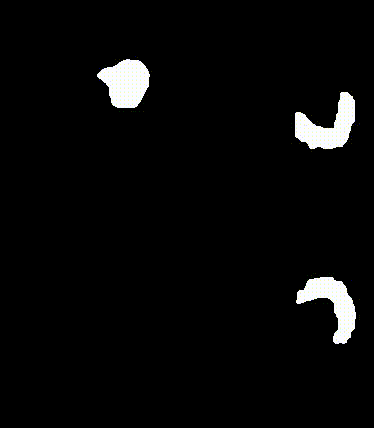

# Cardio Volume Skewer

Cardio Volume Skewer is a Python package designed to generate synthetic 4D sequences of cardiac CT scans from a single 3D image. By implementing the method detailed in our [paper](https://arxiv.org/abs/2406.01040), this package creates a new 3D frame along with 3D optical flow ground truth information through radial, longitudinal, and circumferential deformations around the main axis of the cardiac left ventricle (LV).

## Installation

You can install the package via pip:
```
pip install git+https://github.com/shaharzuler/cardio_volume_skewer
```

## Sample Output:


## Overview
The package offers flexibility through configurable parameters including:

- Magnitude of deformation for each component.
- Number of frames composing the deformation.
- Distribution method of the circumferential component along the main axis.
- Application of deformation- optionally solely over the voxels contained in the LV segmentation mask.
- Optional image scale-down for computational efficiency.

## Example Usage

```python
from cardio_volume_skewer import create_skewed_sequences

output_dir="path/to/outputs/folder"
r1, r2, h, theta1, theta2 = 0.7, 0.7, 0.85, -20.0, 60.0

paths = create_skewed_sequences(
    r1s_end=r1, r2s_end=r2, theta1s_end=theta1, theta2s_end=theta2, hs_end=h,
    output_dir=output_dir, 
    template_3dimage_path="path/to/img_xyz_arr.npy",
    template_mask_path="path/to/LV_mask.npy",
    template_extra_mask_path="path/to/myocardioum_mask.npy",
    num_frames=6,
    zero_outside_mask=True,
    blur_around_mask_radious=5,
    theta_distribution_method="linear",
    scale_down_by=1)
```

`template_3dimage_path` expects as input the frame of the systole represented by a NumPy array. `template_mask_path` expects a segmentation mask encompassing the left ventricle myocardium and blood cavity. Additionally, `template_extra_mask_path` expects a segmentation mask containing solely the myocardium.

## Outputs

For each frame, the output includes:

- The deformed 3D frame, template mask, and extra mask (represented as NumPy arrays).
- 3D optical flow ground truth notations.
- Arrays representing the radial, longitudinal, and circumferential components on each voxel for error analysis. See [this](https://github.com/shaharzuler/four_d_ct_cost_unrolling/blob/main/four_d_ct_cost_unrolling/src/trainers/train_framework.py#L175) section  for example usage.

In addition, the following outputs are provided for the entire sequence:

- A video showing the three main sections of the generated sequence, template mask, and extra mask.
- A text file mentioning the actual accepted circumferential component operating on the LV mask.
- A plot for the distribution of the circumferential component along the main axis.


## Details, Rational and Full Implementation
For a comprehensive implementation of our paper, utilizing this package along with additional functionalities, please refer to [CardioSpectrum](https://github.com/shaharzuler/CardioSpectrum) implementation.
 For a detailed explanation of the deformation process and rationale, please consult our [paper](link)

## Sample Masks Outputs

Main sections of generated LV sequence:


Main sections of generated myocardioum sequence:



## Citing

If you find our work useful, please cite us:

```bibtex
@article{zuler2024synthetic,
  title={Synthetic Data Generation for 3D Myocardium Deformation Analysis},
  author={Zuler, Shahar and Raviv, Dan},
  journal={arXiv preprint arXiv:2406.01040},
  year={2024}
}
